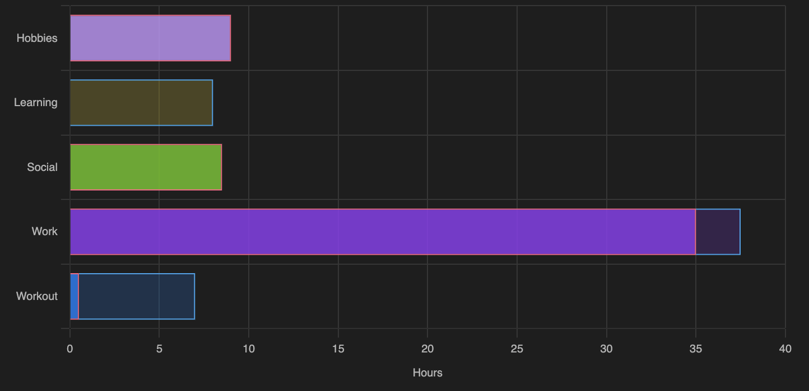

# habit-tracker-in-Obsidian
Plot summary of weekly habits from Google Calendar in Obsidian note

**Habit Tracker** is a tool designed to help you visualize your habits by summarizing weekly Google Calendar data and integrating it into Obsidian. It automates the process of extracting calendar data, generates insightful weekly and monthly summaries, and visualizes your habits with charts in Obsidian notes.

## Features

- **Calendar Data Summarization:** Extracts and summarizes the hours spent on different habits, based on different calendars from Google Calendar.
- **Visualizations:** Generates weekly and monthly habit visualizations in Obsidian using JavaScript.
- **Automation:** Automates weekly data extraction with a cron job.

## Tech Stack

- **Python:** Data extraction and summarization.
- **JavaScript:** Visualizations in Obsidian.
- **Obsidian:** Note-taking and visualization platform.
- **Cron Jobs:** Automation of weekly data extraction.

## Installation

### Prerequisites
1. **Google Calendar API Access:** Ensure you have access to the Google Calendar API and have set up API credentials.
2. **Python 3.7+**

### Steps
1. Clone the repository:
   ```bash
   git clone https://github.com/SaraMolas/habit-tracker-in-Obsidian.git
   cd habit-tracker-in-Obsidian
   ```
2. Update the Python script, to customize the following parameters:
   - Path to your Obsidian vault: Update the script with the file path to your Obsidian vault where the results will be stored.
   - Select specific calendars (Optional): If you don’t want to extract data from all your Google Calendars (e.g., to exclude shared calendars like work meetings), modify the script to include only the names of the calendars you want to track.

3. Install Python dependencies:
   ```bash
   pip install -r scripts/requirements.txt
   ```
4. Set up your Google Calendar API:
   - Place your `credentials.json` file in the `scripts/` directory (the same folder in which you'll download the create_summary_Google_calendar.py)
   - Follow [Google's API setup guide](https://developers.google.com/calendar/quickstart/python) for more details.

5. Set up the cron job:
   - Refer to `docs/cron_setup.md` for instructions on scheduling weekly data extraction.

6. Set up the visualization in Obsidian:
   - Follow the instructions in `docs/Obsidian_setup.md` to set up the summary visualization in an Obsidian note file. 
   - Copy the contents of `scripts/plot_in_Obsidian.js` into an Obsidian note where you want to display the visualizations.

## Usage

### Weekly Data Extraction
Run the Python script manually or let the cron job handle it

### Viewing Results in Obsidian
- Open your Obsidian note with the JavaScript code.
- Visualizations for the last week and monthly summary will be displayed.



## Contributing

Contributions are welcome! Feel free to fork the repository, make changes, and submit a pull request.

## License

This project is licensed under the [MIT License](LICENSE).

## Acknowledgments

- Google Calendar API documentation: [Google Calendar API](https://developers.google.com/calendar)
- Obsidian: [Obsidian](https://obsidian.md)

